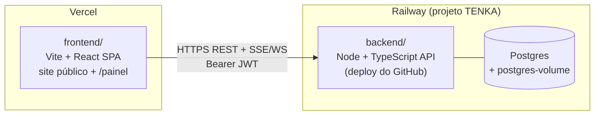

# Planejamento — Split Frontend (Vercel) + Backend (Railway)

> Objetivo: separar o TENKA em **`frontend/`** (deploy no Vercel) e **`backend/`**
> (deploy no Railway: serviço Node + Postgres com volume), **cortando o Supabase
> por completo**. Auth, banco e regras de negócio passam a ser código próprio.

---

## 1. Ponto de partida — o que é o "backend" hoje

Hoje **não existe backend próprio**. O TENKA é um SPA Vite/React puro e todo o
"servidor" é **Supabase (BaaS)**. Cortar o Supabase significa reimplementar, em
código, tudo que está listado abaixo:

| Camada Supabase | O que faz hoje | Vira o quê no backend próprio |
| --- | --- | --- |
| **Auth (GoTrue)** | Login e-mail/senha, sessão, JWT, refresh, "lembrar-me" | Rotas `/auth/*` + hash de senha (bcrypt) + emissão/refresh de JWT próprio |
| **Postgres** | 7 tabelas: `profiles`, `projects`, `project_assignees`, `project_notes`, `notifications`, `project_activity`, `daily_tasks` | Postgres do Railway (migrations reaproveitadas) |
| **RLS** (18 policies) | Autorização por linha (admin vê tudo; colaborador só o que é atribuído; notificação só a própria) | **Middleware de autorização na aplicação** (as policies deixam de existir) |
| **Helpers SECURITY DEFINER** | `is_admin()`, `is_assigned()` | Funções em SQL (mantidas) + checagem na app |
| **Triggers** (13) | `handle_new_user`, `guard_profile_update`, `guard_notification_update`, `log_project_*`, `on_assignee_*`, `log_note_*`, `touch_updated_at` | **Mantidos em SQL** (ver truque do `app.user_id` na seção 6) |
| **RPCs transacionais** | `create_project`, `move_project`, `create_daily_task`, `move_daily_task` | **Mantidas em SQL** + expostas por rotas REST |
| **Edge Function `admin-users`** | Cria/convida usuário com service role (única superfície privilegiada) | Rotas admin `/admin/users` protegidas por papel |
| **Realtime** (`postgres_changes`) | Live update em `projects`, `notifications`, `project_assignees` (Kanban, sino, Diárias) | **SSE ou WebSocket** próprio (ver seção 7) |

**Superfície no frontend a reescrever** (tudo usa `@supabase/supabase-js`):
`AuthContext.tsx` + 5 services (`projectsService`, `dailiesService`,
`notificationsService`, `teamService`, `usersService`) + `lib/supabase/client.ts`
+ 3 assinaturas realtime (`useDailies`, `NotificationsContext`, `useKanban`) +
telas do painel que checam `isSupabaseConfigured`.

O site público (hero, `/games` WebGL, `/multimidia`, `/desenvolvimento`,
`/contato`) **não toca no Supabase** — migra sem alteração de lógica.

---

## 2. Arquitetura alvo



- **Vercel** serve o SPA estático. `VITE_API_URL` aponta para a URL pública do
  backend no Railway.
- **Railway** roda dois serviços no mesmo projeto: **Postgres** (plugin gerenciado
  com volume persistente) + **backend** (Node, deploy a partir do repositório
  GitHub — exatamente o padrão do print "coliseu", renomeado para **tenka**).
- CORS no backend libera apenas o domínio do Vercel.

---

## 3. Estrutura de pastas

O diretório atual `TENKA/` **é** a pasta `tenka`. Reorganizar assim:

```
TENKA/
├─ frontend/            # tudo que hoje está na raiz (SPA)
│  ├─ src/ index.html vite.config.ts tsconfig*.json
│  ├─ package.json      # deps de UI (react, three, gsap, dnd-kit, ...)
│  ├─ vercel.json       # rewrites SPA + config de build
│  └─ .env.local        # VITE_API_URL
├─ backend/             # NOVO — API Node
│  ├─ src/
│  │  ├─ index.ts               # bootstrap do servidor
│  │  ├─ db/ (pool, migrate)
│  │  ├─ migrations/            # SQL portado do supabase/migrations
│  │  ├─ auth/ (hash, jwt, middleware)
│  │  ├─ modules/ (projects, dailies, notifications, users, activity)
│  │  └─ realtime/ (SSE/WS)
│  ├─ package.json
│  ├─ Dockerfile        # ou Nixpacks (Railway detecta Node sozinho)
│  └─ .env
├─ shared/              # OPCIONAL — tipos de contrato (DTOs) p/ ambos
│  └─ types.ts
└─ docs/
```

Cada pasta com seu próprio `package.json`. No Vercel o **Root Directory =
`frontend`**; no Railway o **Root Directory = `backend`**. O `supabase/` atual
é aposentado (migrations são portadas para `backend/src/migrations`).

> **Decisão a confirmar — monorepo com npm workspaces?** Recomendo **manter
> simples**: dois pacotes independentes, sem workspace na raiz. Workspaces
> compartilhariam os tipos de `shared/`, mas complicam o install isolado que
> Vercel/Railway fazem por pasta. Se quiser tipos compartilhados sem workspace,
> geramos um cliente a partir do OpenAPI do backend, ou copiamos `shared/types.ts`.

---

## 4. Stack do backend (recomendações)

| Escolha | Recomendação | Por quê |
| --- | --- | --- |
| Runtime | **Node 22 + TypeScript** | Mesmo ecossistema do front; Railway detecta nativamente |
| Framework HTTP | **Fastify** (Express é alternativa OK) | Validação por schema, rápido; Express se preferir familiaridade |
| Driver de banco | **`pg` (node-postgres)** + **Kysely** para queries tipadas | Mantém o SQL/migrations/triggers como estão; Kysely dá tipos sem esconder SQL |
| Migrations | Runner que roda os `.sql` em ordem (`node-pg-migrate` ou script próprio) | Reaproveita os 1.181 linhas de SQL já testadas |
| Hash de senha | **bcrypt** (`bcryptjs`) | GoTrue já usa bcrypt → dá para **migrar hashes e preservar senhas** (seção 8) |
| JWT | `jsonwebtoken` (HS256 com `JWT_SECRET`) + refresh token | Substitui o token do GoTrue |
| Validação | **Zod** (já usado no front) | Reuso de schemas |
| Realtime | **SSE** (recomendado) ou `ws`/socket.io | Notificações e Kanban ao vivo (seção 7) |

> Deliberadamente **não** recomendo Prisma/Drizzle aqui: a lógica de negócio
> vive em triggers/plpgsql que um ORM não modela bem. Manter SQL bruto +
> Kysely preserva a maior parte do investimento já validado.

---

## 5. RLS → autorização na aplicação

Sem RLS, **cada rota** precisa aplicar as mesmas regras. Mapa direto:

- `is_admin(uid)` → middleware `requireAdmin` (lê papel do JWT/`profiles`).
- `is_assigned(pid, uid)` → checagem em `project_assignees` antes de ler/mover.
- **projects_select**: admin → todos; colaborador → `WHERE id IN (assigned)`.
- **projects_insert/update/archive/finalize**: só admin.
- **project_notes**: leitura/escrita se admin ou atribuído; editar só o autor.
- **notifications**: sempre `WHERE user_id = :me`; só altera `seen_at/read_at`.
- **project_activity**: leitura conforme acesso ao projeto; escrita só via
  triggers/serviços (nunca rota direta).
- **daily_tasks**: mural compartilhado — qualquer autenticado (RLS era `using(true)`).

Regra de ouro: **nenhuma query sai sem passar pelo filtro de papel/atribuição**.
Centralizar num repositório por módulo evita esquecer o filtro.

---

## 6. Triggers e RPCs — o truque que salva o SQL já testado

Os triggers/RPCs usam `auth.uid()` (id do usuário logado) e referenciam
`auth.users`. Para mantê-los quase intactos:

1. Criar tabela própria **`public.users`** (id, email, `password_hash`,
   `confirmed_at`, `created_at`). `profiles.id` passa a referenciar `users(id)`.
2. Substituir `auth.uid()` por `current_setting('app.user_id', true)::uuid`.
3. No início de **toda transação autenticada**, o backend executa
   `select set_config('app.user_id', $1, true)` com o id do usuário do JWT.
   Assim os triggers de auditoria/notificação e as RPCs `create_project` /
   `move_project` / `create_daily_task` / `move_daily_task` continuam funcionando
   **sem reescrever a lógica** (posicionamento, guardas do último admin, notificação
   de atribuição, trilha de atividade).
4. `handle_new_user` (era trigger em `auth.users`) vira trigger em `public.users`
   ou é feito na mesma transação de criação do usuário.
5. Remover `alter publication supabase_realtime ...` (Realtime é próprio agora).
6. `grant ... to authenticated` deixa de ser necessário (sem RLS/roles do Postgres);
   o backend conecta como dono do banco.

Isso transforma a migração de "reescrever regras de negócio" em "portar SQL +
trocar a fonte do `uid`" — muito menos risco de regressão no painel.

---

## 7. Realtime (Kanban, sino de notificações, Diárias)

Hoje 3 pontos usam `postgres_changes`. Substituir por **SSE** (recomendado, mais
simples que WebSocket para push servidor→cliente):

- `GET /events` (SSE, autenticado) — o cliente assina; o backend emite eventos
  `project:*`, `notification:*`, `daily:*` para os usuários com acesso.
- Após cada mutação (mover projeto, criar nota, nova notificação), o serviço
  publica o evento no barramento em memória → SSE entrega aos assinantes.
- Frontend: trocar `supabase.channel(...).on('postgres_changes', ...)` por um
  `EventSource` que dispara o mesmo `refetch()` que já existe hoje.

> Fallback pragmático de curto prazo: **polling** (refetch a cada N s) para
> destravar o corte do Supabase e trocar por SSE em seguida. Decisão sua.

---

## 8. Autenticação própria + migração de usuários

- **Login**: `POST /auth/login {email,password}` → verifica bcrypt → devolve
  access token (JWT curto) + refresh token (cookie httpOnly ou storage).
- **Sessão/"lembrar-me"**: o adaptador local/sessionStorage do front continua,
  guardando o token próprio no lugar do token do Supabase.
- **Conta desativada**: `profiles.active = false` derruba a sessão (regra que já
  existe no `AuthContext`, agora validada pelo backend a cada request).
- **Migração de senhas (ganho importante)**: o GoTrue guarda `encrypted_password`
  em **bcrypt**. Um `pg_dump` de `auth.users` permite importar e-mail + hash para
  `public.users` → **usuários mantêm as senhas atuais**, sem reset em massa.
- **admin-users**: as ações `create_user`/`invite_user` viram rotas
  `POST /admin/users` protegidas por `requireAdmin` (mesma checagem de "admin
  ativo" que a Edge Function fazia).

---

## 9. Deploy

### Railway (backend + Postgres)
1. Criar projeto **tenka** no Railway.
2. Adicionar plugin **Postgres** (cria o `postgres-volume` do print).
3. Serviço **backend** a partir do repo GitHub → **Root Directory = `backend`**.
4. Variáveis: `DATABASE_URL` (referência ao Postgres do projeto), `JWT_SECRET`,
   `REFRESH_SECRET`, `CORS_ORIGIN` (domínio Vercel), `NODE_ENV=production`.
5. Migrations no deploy: script de release (`predeploy`/`start` roda `migrate`
   antes de subir a API). Ver skill `deployment-procedures` para lock/rollback.
6. Gerar domínio público (`tenka-production.up.railway.app`) → alimenta o front.

### Vercel (frontend)
1. Importar o repo → **Root Directory = `frontend`**, framework **Vite**.
2. Build `npm run build`, output `dist`. `vercel.json` com rewrite SPA
   (`/* → /index.html`) para o React Router.
3. Env `VITE_API_URL = https://tenka-production.up.railway.app`.
4. Remover `VITE_SUPABASE_*`.

---

## 10. Migração de dados (se já há dados em produção)

O painel está em uso (leads, carteira, diárias) — provavelmente há dados reais.

1. `pg_dump` do Postgres do Supabase (schema `public` — dados) + `auth.users`.
2. Ajustar: mapear `auth.users` → `public.users` (id, email, hash bcrypt).
3. `psql` importando no Postgres do Railway **após** rodar as migrations.
4. Conferir sequências, `position` das colunas do Kanban e contagens por tabela.
5. Validar login de um usuário real (senha preservada) e um fluxo de mover projeto.

---

## 11. Fases de execução (ordem sugerida)

- [ ] **F0 — Reestruturar pastas.** Mover SPA para `frontend/`, criar `backend/`
      esqueleto. Garantir que o front ainda builda. Inicializar git (repo é
      necessário para deploy GitHub→Railway/Vercel).
- [ ] **F1 — Backend base.** Fastify + `pg` + Kysely + runner de migrations +
      healthcheck. Subir Postgres local (Docker) e Railway vazio.
- [ ] **F2 — Portar schema.** Migrations 0001–0009 adaptadas (users próprio,
      `app.user_id`, sem publication/grants). Rodar e conferir triggers/RPCs.
- [ ] **F3 — Auth.** hash bcrypt, JWT+refresh, `/auth/*`, middleware de papel.
- [ ] **F4 — Módulos REST.** projects (+RPCs), dailies (+RPCs), notifications,
      users/admin, activity — cada rota com o filtro de autorização da seção 5.
- [ ] **F5 — Realtime.** SSE + barramento de eventos (ou polling provisório).
- [ ] **F6 — Frontend.** Trocar `lib/supabase` por um `apiClient` (fetch+JWT);
      reescrever os 5 services e `AuthContext`; trocar as 3 assinaturas realtime.
- [ ] **F7 — Migração de dados** (seção 10) e validação E2E do painel.
- [ ] **F8 — Deploy** Railway + Vercel, CORS, smoke test, cutover, desligar Supabase.

---

## 12. Riscos e pontos de atenção

- **Autorização na app é frágil por natureza** (RLS falhava fechado; código
  falha aberto se esquecer um filtro). Testar cada rota com colaborador não
  atribuído. Considerar teste automatizado por papel.
- **Concorrência no `move_project`**: o `FOR UPDATE`/serialização já existe na
  RPC — preservá-la (não reimplementar em JS) evita corromper `position`.
- **Datas em UTC nas Diárias** (`weeks.ts`): a lógica é do front e não muda, mas
  o backend deve gravar/ler `YYYY-MM-DD` sem timezone shift.
- **Realtime**: perda de "ao vivo" se ficar só em polling — alinhar expectativa.
- **Segredos**: `JWT_SECRET`/`DATABASE_URL` só em env do Railway, nunca no bundle
  (ver skill `secrets-management`).
- **Sem git hoje**: deploy GitHub→Railway/Vercel exige repositório versionado.

---

## 13. Estimativa (ordem de grandeza)

Reescrita real de backend + migração de dados + refactor do data layer do front.
Grosso modo **8–13 dias** de trabalho focado, sendo F4 (módulos REST) e F6
(refactor do front) as fatias maiores. Reduz para ~6–8 dias se aceitar **polling
no lugar de SSE** na primeira entrega.
